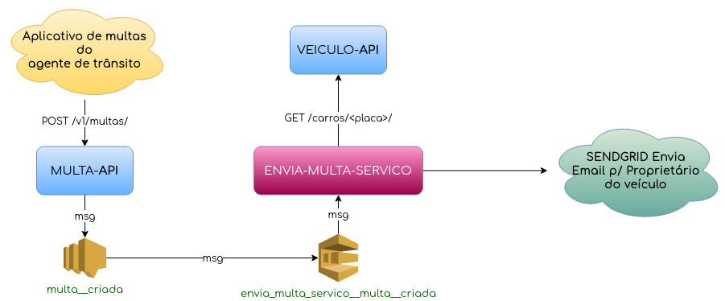

===========================================================================
Palestra Desvendando uma arquitetura de microsserviços baseada em eventos
===========================================================================

O projeto exemplifica uma simples plataforma de um Departamento de Trânsito, onde
multas são cadastradas e as mesmas são enviadas para os emails dos Proprietários.

Para a construção dessa plataforma de microsserviços, foi utilizada as seguintes tecnologias:

- `Boto3`_: É o SDK da AWS para Python, que permite desenvolvedores Python utilizarem serviços como o Amazon SNS e SQS em suas aplicações;
- `Django`_: É um framework Web open source que lhe permitirá escrever aplicações web sem precisar reinventar a roda;
- `Django Rest Framework`_: É um kit de ferramentas que auxilia na criação de APIs REST em cima do framework Django;
- `Loafer`_: É um biblioteca que auxilia na contrução de aplicações assíncronas que consumem mensagens enviadas para filas SQS;
- `SQS`_: É um serviço da AWS de filas de mensagens que permite o desacoplamento e a escalabilidade de microsserviços. Nosso microsserviço obterá as mensagens por meio de um fila SQS.
- `SNS`_: É um serviço da AWS de publicação de mensagens em tópicos que permite o desacoplamento de microsserviços. Nossa API irá publicar mensagens em um determinado tópico que possui uma fila SQS inscrita.

.. _Boto3: https://boto3.amazonaws.com/v1/documentation/api/latest/index.html
.. _Django: https://www.djangoproject.com/
.. _Django Rest Framework: https://www.django-rest-framework.org/
.. _Loafer: https://loafer.readthedocs.io/en/latest/
.. _SQS: https://aws.amazon.com/pt/sqs/
.. _SNS: https://aws.amazon.com/pt/sns/

Diagrama de Fluxo de Funcionamento da plataforma
-------------------------------------------------

Configurando o Projeto
-----------------------

1. Antes de tudo faça o clone do projeto executando o comando abaixo.

.. code-block:: console

   $ git clone git@github.com:olist/palestra-microservicos.git
   $ cd palestra-microservicos

2. Para instalar tudo que é necessario para rodar as apis e o serviço basta executar o comando abaixo.

.. code-block:: console

   ~/palestra-microservicos $ make inicializar_projeto

Levantando as aplicações
-------------------------
- Para levantar a api de multas abra um terminal e execute o comando abaixo.

.. code-block:: console

   ~/palestra-microservicos $ levantar_multa_api

- Para levantar a api de veiculo abra um terminal e execute o comando abaixo.

.. code-block:: console

   ~/palestra-microservicos $ levantar_veiculo_api

- Para levantar o serviço de envio de multas abra um terminal e execute o comando abaixo.

.. code-block:: console

   ~/palestra-microservicos $ levantar_envia_multa_servico

Observação
^^^^^^^^^^
Caso queira que o serviço de envio de multas envie as multas por email, configure a envvar SENDGRID_API_KEY no arquivo .env do **envio-multa-servico**.
Para isso você deverá ter uma conta no `sendgrid`_ e uma api key para pode usar a api do sendgrid (Sem custo).

.. _sendgrid: https://sendgrid.com/
