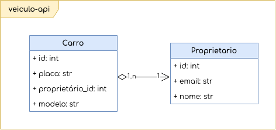

===========
veiculo-api
===========

API de veículos que armazena informações sobre proprietários e veículos.

Endpoints
---------

Listagem de Carros
^^^^^^^^^^^^^^^^^^

Requisição
##########

**GET** http://localhost:8000/v1/carros/

Resposta
########

HTTP status code 200 OK

.. code-block:: json

    [
        {
            "id": 1,
            "proprietario": {
                "id": 1,
                "nome": "Antônio Nunes",
                "email": "antonio_nunes_loki@gmail.com"
            },
            "placa": "kkk-1111",
            "modelo": "gol"
        },
        {
            "id": 2,
            "proprietario": {
                "id": 2,
                "nome": "Pedro de lara",
                "email": "pedro_de_lara@gmail.com"
            },
            "placa": "kkk-2222",
            "modelo": "santana"
        }
    ]

Criação de Carros com Proprietários
^^^^^^^^^^^^^^^^^^^^^^^^^^^^^^^^^^^

Requisição
##########

**POST** http://localhost:8000/v1/carros/

**Payload**

.. code-block:: json

    {
        "proprietario": {
            "nome": "Antônio Nunes",
            "email": "antonio_nunes_loki@gmail.com"
        },
        "placa": "kkk-1111",
        "modelo": "gol"
    }

Resposta
########

HTTP status code 201 Created

.. code-block:: json

    {
        "id": 1,
        "proprietario": {
            "id": 1,
            "nome": "Antônio Nunes",
            "email": "antonio_nunes_loki@gmail.com"
        },
        "placa": "kkk-1111",
        "modelo": "gol"
    }

Requisição
##########

**POST** http://localhost:8000/v1/carros/

**Payload**

.. code-block:: json

    {}

Resposta
########

HTTP status code 400 Bad Request

.. code-block:: json

    {
        "proprietario": ["This field is required."],
        "placa":["This field is required."],
        "modelo":["This field is required."]
    }

Busca de um Carro
^^^^^^^^^^^^^^^^^^

Requisição
##########

**GET** http://localhost:8000/v1/carros/kkk-1111/

Resposta
########

HTTP status code 200 OK

.. code-block:: json

    {
        "id": 1,
        "proprietario": {
            "id": 1,
            "nome": "Antônio Nunes",
            "email": "antonio_nunes_loki@gmail.com"
        },
        "placa": "kkk-1111",
        "modelo": "gol"
    }

Requisição
##########

**GET** http://localhost:8000/v1/carros/kkk-7676/

Resposta
########

HTTP status code 404 Not Found

.. code-block:: json

    {
        "detail": "Not found."
    }